# Insure user guide

This guide walks through everything you can do on Insure, step by step:

- **[Get set up](#1-get-set-up)**: a wallet, test SOL and test USDC.
- **[Farmers: drought cover](#2-farmers-drought-cover)**: buy, renew, claim, get paid.
- **[Travellers: flight-delay cover](#3-travellers-flight-delay-cover)**: buy for a flight, claim after departure.
- **[Checking any payout](#4-checking-any-payout)**: how to verify a decision yourself.
- **[Underwriters: running a vault](#5-underwriters-running-a-vault)**: price a risk, fund it, manage it, close it.
- **[Rules at a glance](#6-rules-at-a-glance)**: every time window and limit in one table.
- **[Troubleshooting](#7-troubleshooting)**: what each error message means and how to fix it.

> Insure currently runs on Solana **devnet** with test money. Nothing here costs real funds.
> The screenshots come from a local test network with a fast-forwarded clock, so their dates are in the future.

---

## How Insure works in one minute

Insure sells **parametric** insurance: instead of assessing damage, each policy pays a fixed amount of USDC when a measurable event happens.

- **Drought cover** pays if rainfall at your farm stays below a threshold for a set number of days.
- **Flight-delay cover** pays if your flight is cancelled, diverted, or late by at least a set number of minutes.

Cover is sold from **vaults**. A vault is a pool of USDC put up by an **underwriter**, with one published rule, one premium and one payout.

When you file a claim, the **oracle**:
1. fetches the real-world data (rainfall from Open-Meteo; flight status from a flight-data provider);
2. applies the vault's rule — plain code, no human judgement and no AI verdict;
3. pays you automatically if the rule is met;
4. records the measured value and a fingerprint (SHA-256 hash) of all the evidence on-chain, so anyone can check the decision afterwards.

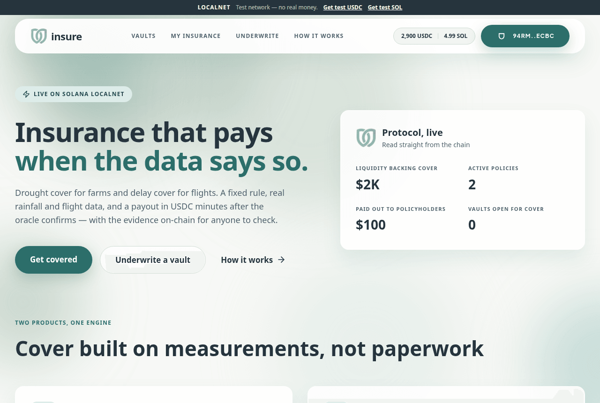

---

## 1. Get set up

You need three things: a Solana wallet, a little SOL for network fees, and USDC to pay premiums.

### A wallet

- **Any Solana wallet** (Phantom, Solflare, Backpack…). Switch it to **Devnet** in its developer or testnet settings, then press **Select wallet** in the top-right corner.
- **No wallet?** Choose **Demo Wallet (devnet)** in the wallet menu. It creates a throwaway wallet inside your browser, so it's instant but tied to that browser. Don't use it for anything you want to keep.

### Test SOL and test USDC

The dark bar at the top of every page has both faucets:

| You need | How to get it |
|---|---|
| **SOL** (network fees and a little account rent; 0.05 SOL is plenty) | Click **Get test SOL** in the top bar. If devnet's airdrop is busy, use <https://faucet.solana.com>. |
| **USDC** (premiums, claim fees, vault deposits) | Click **Get test USDC** (<https://faucet.circle.com>), choose **Solana Devnet** and paste your wallet address. |

Once connected, your live balances show next to the wallet button, for example `200 USDC | 5.00 SOL`.

Insure works the same on a phone: the menu sits behind the ☰ button, and every page adapts to small screens.

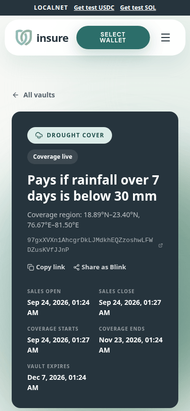

---

## 2. Farmers: drought cover

### Step 1: find a vault

Open **Vaults**. By default you see vaults that are **open now**; use the tabs for vaults *opening soon* or with *coverage live*, filter by **Drought**, and sort by payout, premium, capacity or closing date.

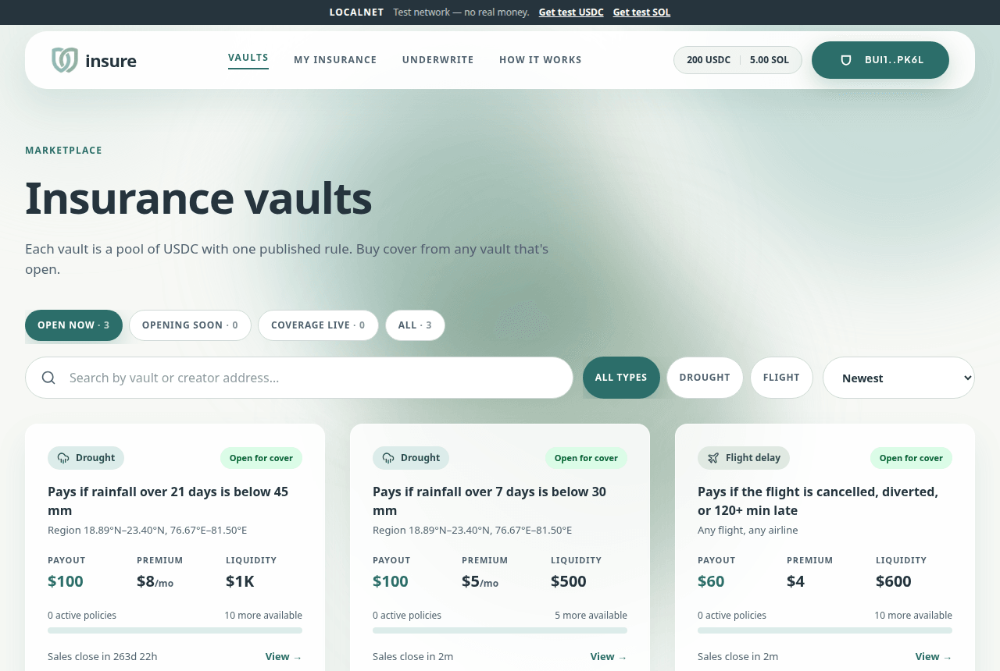

Each card tells you the rule in plain words ("Pays if rainfall over 21 days is below 45 mm"), the payout, the monthly premium, the region it covers, how many more policies it can sell, and when sales close.

### Step 2: pin your farm and check the history

Open a vault. Under **Buy a policy**:

1. **Pin your farm.** Search for your village or town, press **Use my location**, or click on the map. The outlined box is the vault's **coverage region**; your farm must be inside it.
2. **Check the history.** Insure replays the vault's exact rule over the same weeks in each of the **last 10 years at your pin**, using ERA5 rainfall data. Orange bars marked **Payout** are years it would have paid you.

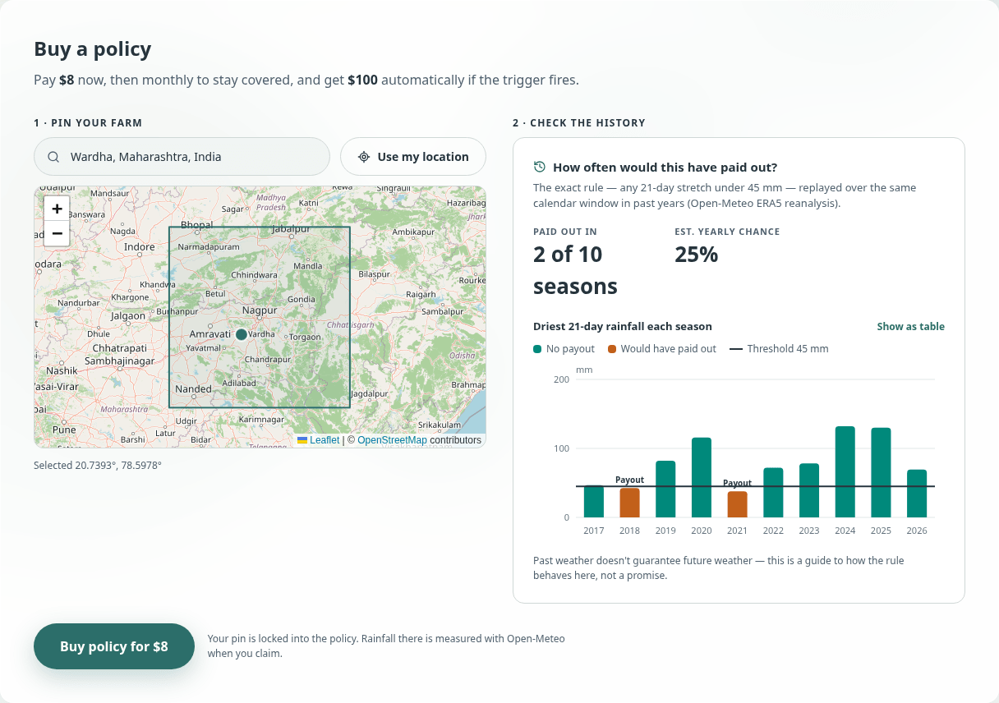

In this example, the rule would have paid in 2018 and 2021, so **2 of the last 10 monsoons**. Use it to judge whether the cover fits your farm; past weather is a guide, not a promise.

### Step 3: buy

Press **Buy policy**. Your wallet asks you to approve one transaction that:

- pays the **first month's premium**, and
- **locks your farm location** into the policy. It can't be changed later, by you or anyone else.

A notification confirms it, and the panel switches to **Your policy**.

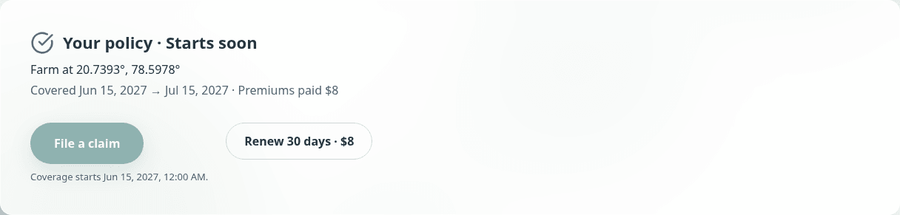

**When does cover start?** At the vault's *Coverage starts* date (shown in the dark header). Until then the policy says **Starts soon**.

### Step 4: stay covered (monthly renewal)

Drought policies are paid monthly. Your first premium covers **30 days from the start of coverage** (or less, if the vault's coverage period is shorter).

- Press **Renew 30 days** to add another 30 days.
- You can renew any time before your cover ends, and up to **10 days after** it ends (a grace period).
- Cover never extends past the vault's *Coverage ends* date. Once you're paid up to it, the renew button tells you so.

If you stop renewing and the grace period passes, the policy **lapses**.

### Step 5: file a claim

When it's been dry, press **File a claim**. You don't fill in any form; the oracle already knows your farm and the rule.

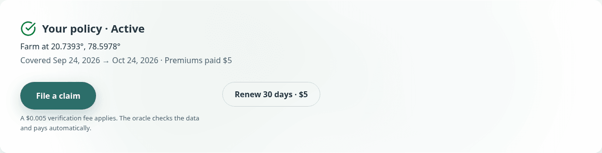

- **When you can file:** once a full observation window has passed since your coverage started. For a 21-day vault, that's 21 days after cover begins. You can file any time after that while you're covered, and for up to **7 days after** your paid cover ends.
- **What's measured:** total rainfall at your pin over the *N full days before the day you file* (N is the vault's observation window). If you file during the 7-day grace, the window ends on your last covered day instead, so uncovered days never count.
- **Cost:** a **0.005 USDC** verification fee, which stops spam claims.
- **One at a time:** you can have one claim being checked at a time.

If the button is greyed out, the text under it says exactly why and when you can file.

### Step 6: get paid

The page updates by itself. Weather claims usually settle within a minute or two:

- **Approved:** the vault's full payout arrives in your wallet as USDC, and you get a notification like *"Claim approved — $100 sent to your wallet"*.
- **Rejected:** the rule wasn't met (it rained more than the threshold). Your policy stays active, so if it stays dry you can file again later.

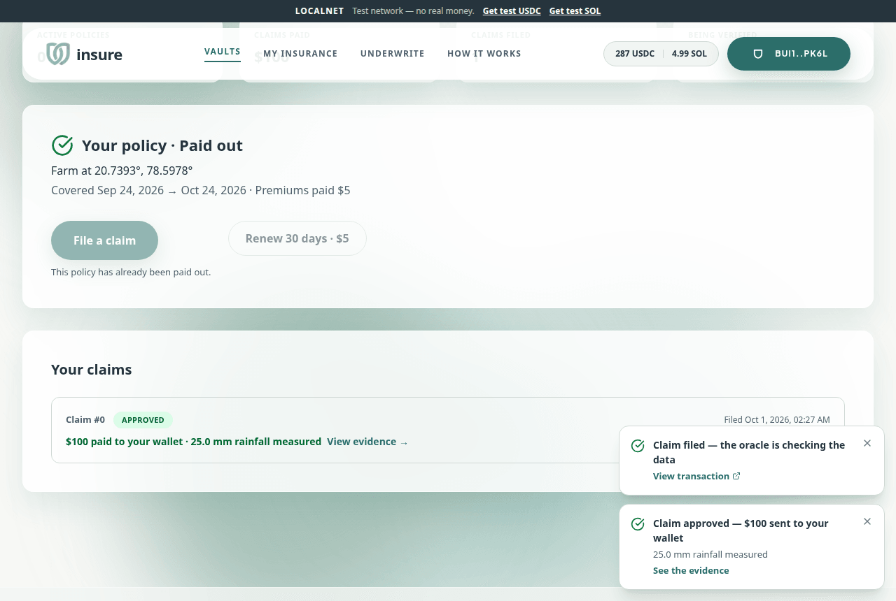

Each policy pays out **once**. After a payout it shows **Paid out**.

### Your policies

**My Insurance** lists every policy you hold across vaults, with its status (*Starts soon*, *Active*, *Claim pending*, *Paid out*, *Lapsed* or *Expired*), cover dates, premiums paid and claim history.

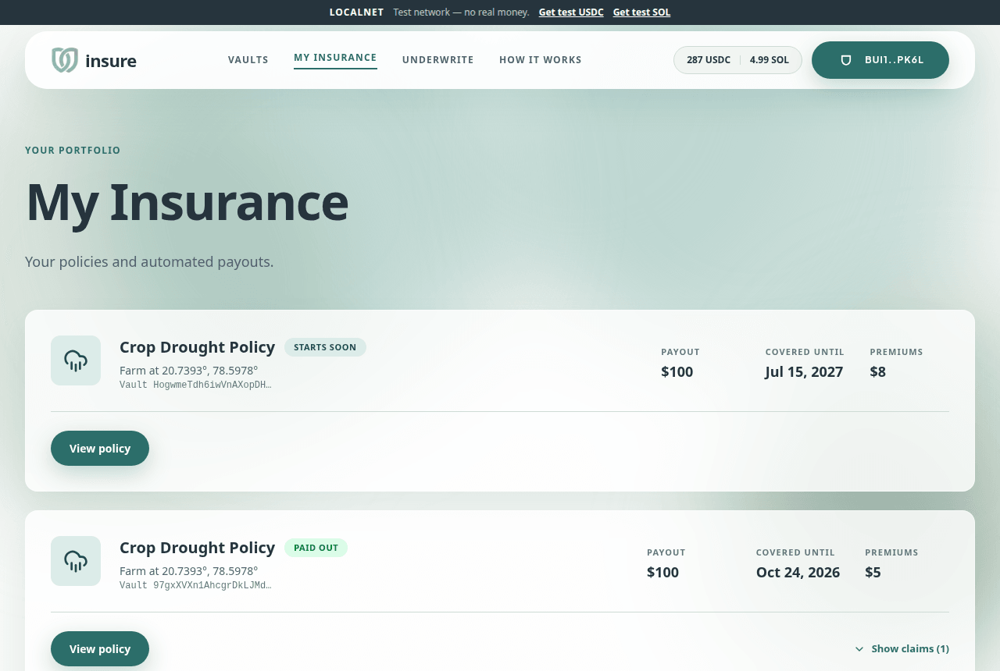

---

## 3. Travellers: flight-delay cover

Flight cover works like drought cover, with three differences: you pay **once**, you insure **one flight**, and the trigger is a delay or cancellation.

### Buy

Open a **Flight delay** vault and enter:

- your **flight number** in IATA form (the airline code plus number, as on your ticket, e.g. `AI101`), and
- your **departure date in UTC**. Pick the date the flight departs in UTC, which can differ from local time for late-night flights.

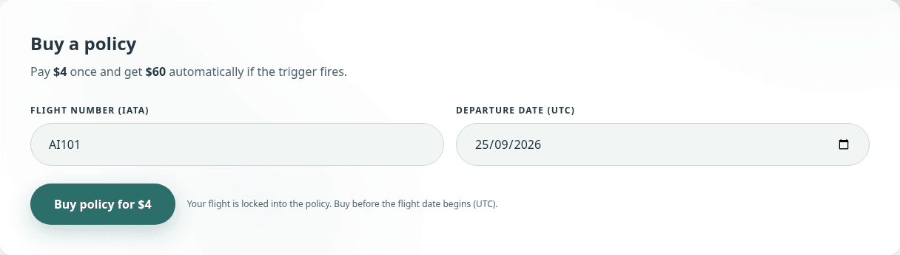

Rules to know:

- You must buy **before your flight date begins** (UTC). Sales close before coverage starts, so you can't insure a flight that's already delayed.
- The flight date must fall inside the vault's coverage period (the date picker only offers valid dates).

### Claim

From your flight date onwards, press **File a claim**. The oracle looks up your flight and **pays if**:

- it was **cancelled**, or
- it was **diverted**, or
- its **departure or arrival** was late by at least the vault's threshold. An early arrival doesn't cancel out a late departure.

If your flight hasn't landed yet and hasn't reached the threshold, the oracle **waits and re-checks automatically**. If no data turns up within 72 hours of filing, the claim is closed as rejected and **you can file again**.

---

## 4. Checking any payout

Every claim has a public page. Open it from **View evidence** on your claim, or from **Latest claims** on the home page. Anyone can open it; you don't need to be the policyholder.

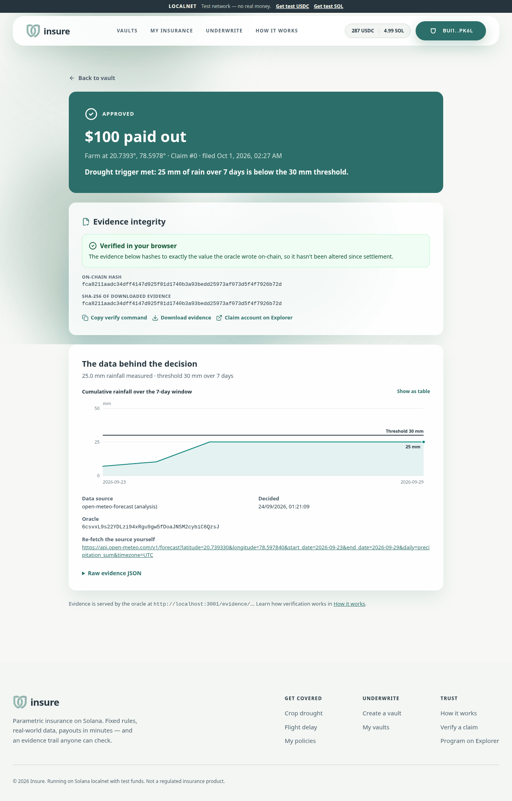

The page shows:

- **The verdict:** approved or rejected, the payout, and a one-line summary such as *"25 mm of rain over 7 days is below the 30 mm threshold."*
- **Evidence integrity.** Your browser downloads the oracle's evidence file, computes its SHA-256 hash and compares it with the hash stored on-chain when the claim was settled.
  - **Verified in your browser** means the evidence is exactly what the decision was made on.
  - **Hash mismatch** means it was changed afterwards; treat it as untrustworthy.
- **The data behind the decision.** For drought claims, a chart of cumulative rainfall against the threshold (switch to a table with **Show as table**). For flight claims, the flight record with its status and delays.
- **Re-fetch the source yourself:** the exact data-provider URL, so you can reproduce the numbers independently.

To verify from a terminal instead, use **Copy verify command**:

```bash
curl -s <oracle-url>/evidence/<CLAIM_ADDRESS> | sha256sum   # compare with the on-chain hash
```

---

## 5. Underwriters: running a vault

As an underwriter you put up the USDC that pays claims. In return you earn a **fee on every premium** and keep what's left when the vault expires.

### Step 1: design the rule and price it

Open **Underwrite → Create a vault** and work through the four sections.

**1 · What do you insure?** Choose **Crop drought** or **Flight delay**.

**2 · The rule.** For drought vaults:

- **Rainfall threshold (mm)** and **observation window (days, 1–90)**: the vault pays if rainfall over any window of that many days is below the threshold.
- **Coverage region.** Search for the centre of the area you'll cover and choose a size (±50 km up to ±500 km). Only farms inside the box can buy. Keep it tight: a price that fits one climate is wrong for a much drier one.
- **Price it.** Insure replays your rule over the last 10 years at the region's centre. It shows how many seasons would have paid out, the estimated yearly chance, and a **suggested monthly premium**; press **Use $X/mo** to apply it.

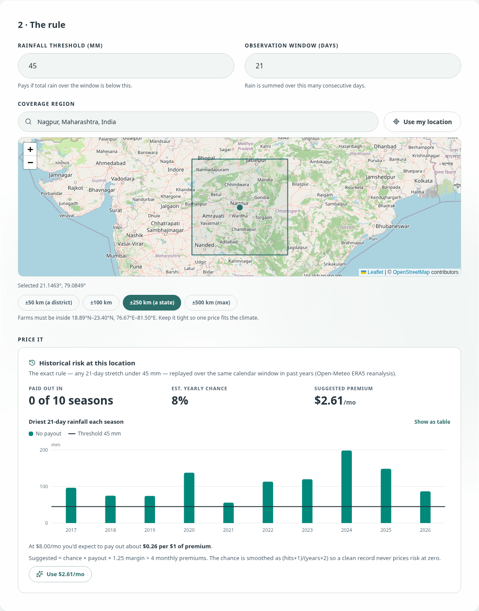

The suggested premium = chance × payout × 1.25 margin ÷ number of monthly premiums. The chance is smoothed as (payout years + 1) / (years + 2), so a spotless history never prices risk at zero. Once you enter a premium, Insure shows the **expected payout per $1 of premium**; above $1.00 (shown in red) the vault loses money on average.

For flight vaults, set the **delay threshold in minutes** (maximum 3 days). Free flight APIs don't offer enough history for a backtest, so price conservatively.

**3 · Money.**

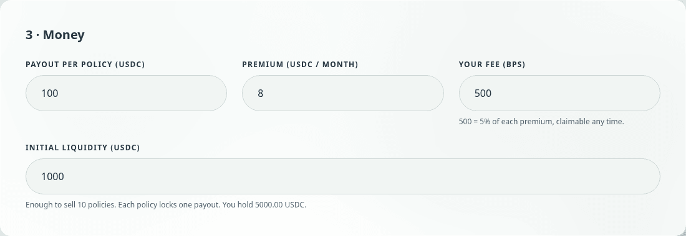

- **Payout per policy:** what each winning claim receives. It must be larger than the premium.
- **Premium:** monthly for drought, one-off for flights.
- **Your fee (bps):** your share of each premium. 500 = 5%; maximum 5000 (50%).
- **Initial liquidity:** every policy you sell locks **one full payout** of your USDC, so $500 of liquidity with a $100 payout lets you sell 5 policies.

**4 · Timeline.** **Reset dates** fills in a sensible schedule. The rules are:

- Sales open in the future, and close before (or when) coverage starts.
- Coverage must be at least as long as the observation window.
- The vault must expire **at least 7 days after coverage ends**, so late claims can still be filed. Leave more (a week or two) so every claim can settle.

Press **Create vault**. The vault and your first deposit go through in **one transaction**, so the vault is funded the moment it exists.

### Step 2: manage it

Open your vault while connected with the underwriter wallet to see **Manage your vault**:

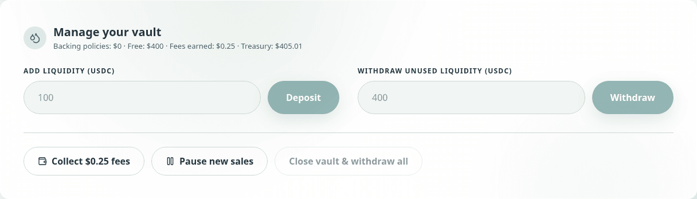

| Action | What it does | When |
|---|---|---|
| **Deposit** | Adds liquidity so you can sell more policies | Until coverage ends |
| **Withdraw unused liquidity** | Takes back USDC that isn't backing any policy | Any time |
| **Collect fees** | Sends your accumulated premium fees to your wallet | Any time |
| **Pause new sales** / **Reopen sales** | Stops or restarts new policy sales | Any time. It never blocks renewals or claim payouts. |
| **Release lapsed policies** | Frees the USDC locked for drought policies whose owners stopped paying and can no longer claim | Appears automatically when there's something to release |
| **Close vault & withdraw all** | Withdraws everything left in the vault | After the vault expires, and once no claims are waiting |

**Underwrite → My vaults** shows all your vaults: totals for liquidity, premiums, fees and claims paid, plus flags like *claims being verified*, *fees to collect* and *ready to close*.

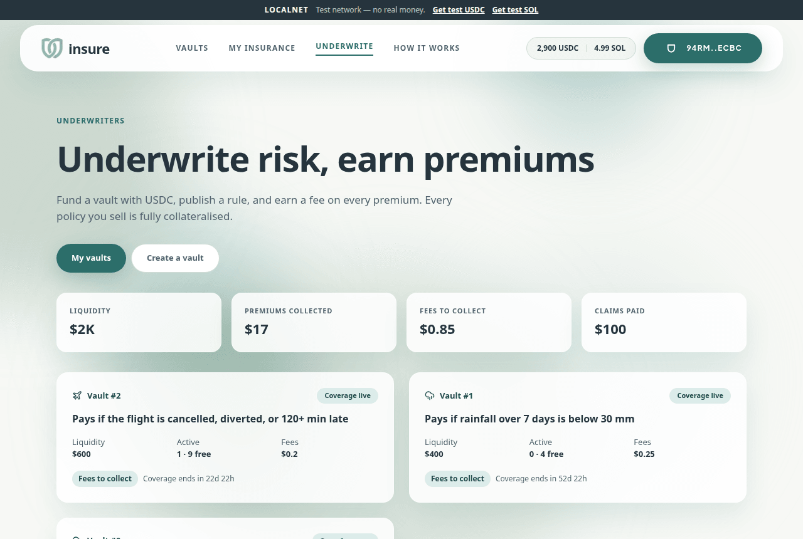

### Step 3: share it

On your vault page, **Copy link** shares the page. **Share as Blink** copies a Solana Action link that lets people buy your cover straight from any Blink-aware wallet or app, without visiting the site.

### What protects your capital, and your customers

- The program **won't sell more cover than your liquidity can pay**, so every policy is fully collateralised.
- Each policy pays **at most once**, only for its locked location or flight, and only via the oracle.
- You **can't** withdraw capital that backs live policies, close the vault while claims are waiting, or use a pause to avoid a payout.
- If the oracle were ever down for more than 7 days after the vault expires, you can still close the vault, so funds are never stuck forever.

---

## 6. Rules at a glance

| Rule | Value |
|---|---|
| Claim verification fee | 0.005 USDC per claim |
| Drought premium period | 30 days per payment, capped at the vault's coverage end |
| Renewal grace | Up to 10 days after your paid cover ends |
| Drought claim window | From *coverage start + observation window* until *paid cover end + 7 days* (and before vault expiry) |
| Rainfall measured over | The N full days (UTC) before you file, ending no later than your last covered day |
| Flight purchase deadline | Before the flight date begins (UTC); sales close before coverage starts |
| Flight claim window | From the flight date until the vault expires |
| Flight trigger | Cancelled, diverted, or departure/arrival late by at least the threshold |
| Data deadline | A claim with no usable data 72 hours after filing is rejected; you can file again |
| Claims per policy | One being checked at a time; one payout per policy |
| Payout | The vault's full payout, in USDC, to your wallet (its USDC account is created if needed) |
| Underwriter fee | 0–50% of each premium |
| Observation window | 1–90 days |
| Coverage region | A box at most 10° across (about ±500 km) |
| Vault expiry | At least 7 days after coverage ends |
| Lapsed-policy release | A drought policy more than 10 days past its paid cover (and past the 7-day claim grace), with no claim pending |

---

## 7. Troubleshooting

| Message | What it means | What to do |
|---|---|---|
| *Insufficient USDC balance* / *You need $X USDC* | Not enough USDC for the premium, fee or deposit | Use **Get test USDC** in the top bar |
| *You don't have a USDC token account yet* | Your wallet has never held this USDC | Get test USDC once; the account is created automatically |
| *You need a little SOL for fees* | No SOL for network fees | **Get test SOL** in the top bar |
| *Subscription is closed right now* | The vault isn't selling (not open yet, or sales closed) | Check the **Sales open / Sales close** dates, or pick another vault |
| *Vault is paused for new subscriptions* | The underwriter paused sales | Pick another vault; existing policies are unaffected |
| *Insufficient liquidity…* / *Fully booked* | All the vault's USDC is backing existing policies | Pick another vault, or wait for the underwriter to add liquidity |
| *This location is outside the vault's coverage region* | Your pin is outside the outlined box | Choose a vault that covers your area |
| *It is too early to file this claim* | The observation window (drought) or your flight date hasn't arrived | The claim panel shows the exact date you can file |
| *Paid coverage doesn't span a full observation window; renew first* | The window is longer than the cover you've paid for | Renew, then file |
| *This policy already has a claim awaiting settlement* | You already have a claim being checked | Wait for it to settle (the page updates by itself) |
| *Your insurance coverage has lapsed* | Past the 10-day renewal grace | Buy a new policy in an open vault |
| *Coverage is already paid up to the end of the vault* | Nothing left to renew | Nothing to do; you're covered to the end |
| *This policy has already been paid out* | Each policy pays once | Buy a new policy for further cover |
| *Transaction cancelled in wallet* | You declined in your wallet | Try again and approve |
| A claim stays **Pending** for flights | The flight hasn't landed or data isn't published yet | Nothing to do; the oracle re-checks automatically for up to 72 hours |

Still stuck? The **How it works** page in the app explains the rules and trust model, and every claim page links to its raw evidence.
